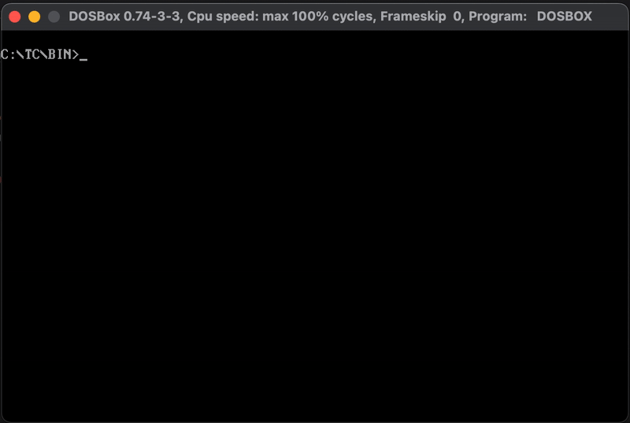

# bfcom

A tiny Brainfuck interpreter packed into a single MS-DOS `.COM` file. You can download the `.COM` executable from [itch.io](https://ms0g.itch.io/bfcom).



## Why?
Because squeezing a full Brainfuck interpreter into a single `.COM` file is absurdly fun.

Because running esoteric code on ancient hardware is the kind of weird joy only retro hackers understand.

Because MS-DOS deserves some love from the 21st century.

And honestly — why not?

## Features
- Fits within a single 64KB segment (`.COM` file format).
- Reads Brainfuck source code from an external `.BF` file.
- Supports all 8 Brainfuck commands: `> < + - . , [ ]`.
- Uses DOS interrupts only — no standard C library.

## Prerequisites
- **Turbo C++** (`TCC.EXE`) version 3.0 or later  
- **Turbo Assembler** (`TASM.EXE`) version 4.1 or later  
- **Turbo Linker** (`TLINK.EXE`) version 5.0 or later  
- **DOSBox** emulator or a real MS-DOS-compatible computer

## Usage
Run the interpreter from a DOS prompt with a `.BF` file as argument:

```bash
C:\>BF.COM HELLO.BF
Hello, World!
```
Make sure both `BF.COM` and the Brainfuck source file (e.g., `HELLO.BF`) are in the same directory.

## License
This project is licensed under the  BSD 3-Clause License. See the LICENSE file for details.

